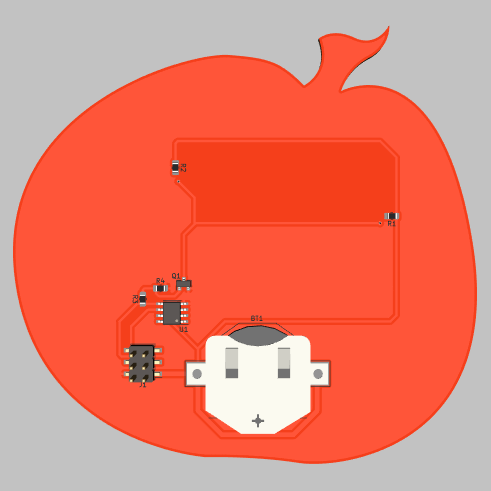
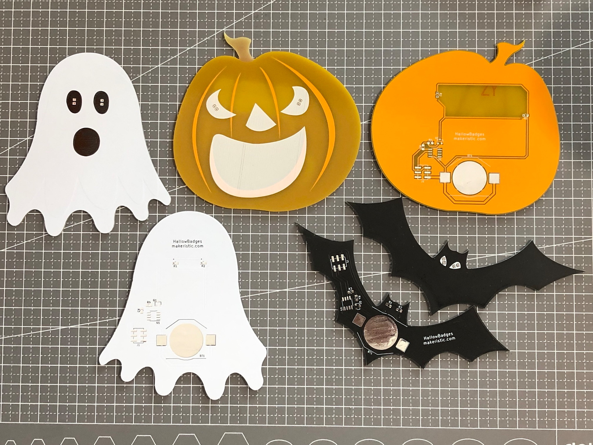

# HallowBadges-Pumpkin

Here is a fun and simple Halloween project, it is a flashing LED badge or decoration with an ATtiny13a microcontroller, powered by a CR2032 battery.  

* A single CR2032 battery can power this device for about 6 days / 144 hours.
* The board also features an optional surface-mount 2.54mm connector which is [Simple Add-ons (SAO)](https://hackaday.io/project/175182-simple-add-ons-sao) compatible so you can power the badges externally.
* You can program the device using a [SOIC-8 Test Clip](https://www.digikey.com/en/products/detail/mueller-electric-co/BU-P5250/9675948) or similar, I attached it to an Arduino-as-ISP setup.

Render of the Front:


Render of the Back:




## Hardware

The boards were manufactured by [JLCPCB](https://jlcpcb.com/), use the gerbers folder for production.  The schematic and KiCad files are all included in this repository.

I created three designs, each can be found on Github:
* [HallowBadges-Bat](https://github.com/makeristic/HallowBadges-Bat)
* [HallowBadges-Ghost](https://github.com/makeristic/HallowBadges-Ghost)
* [HallowBadges-Pumpkin](https://github.com/makeristic/HallowBadges-Pumpkin)




## Software

A simple Arduino sketch is used to blink the LED's at a random interval, just upload to the board to get it started.  See the example below.

```cpp
const uint8_t led  = 0;    // the PWM pin the LED is attached to
uint8_t brightness = 128;   // how bright the LED is

void setup() 
{  
  pinMode(led, OUTPUT);
  
  // Seed the random number generator
  tiny_srandom(analogRead(A3));
}

void loop() 
{
  // On
  analogWrite(led, brightness);
  delay(20 + (tiny_random() % 2000));

  // Off
  analogWrite(led, 0);
  delay(200 + (tiny_random() % 500))
}
```

## Licence

This work is licensed under a [Creative Commons Attribution-ShareAlike 4.0 International License](http://creativecommons.org/licenses/by-sa/4.0/).
